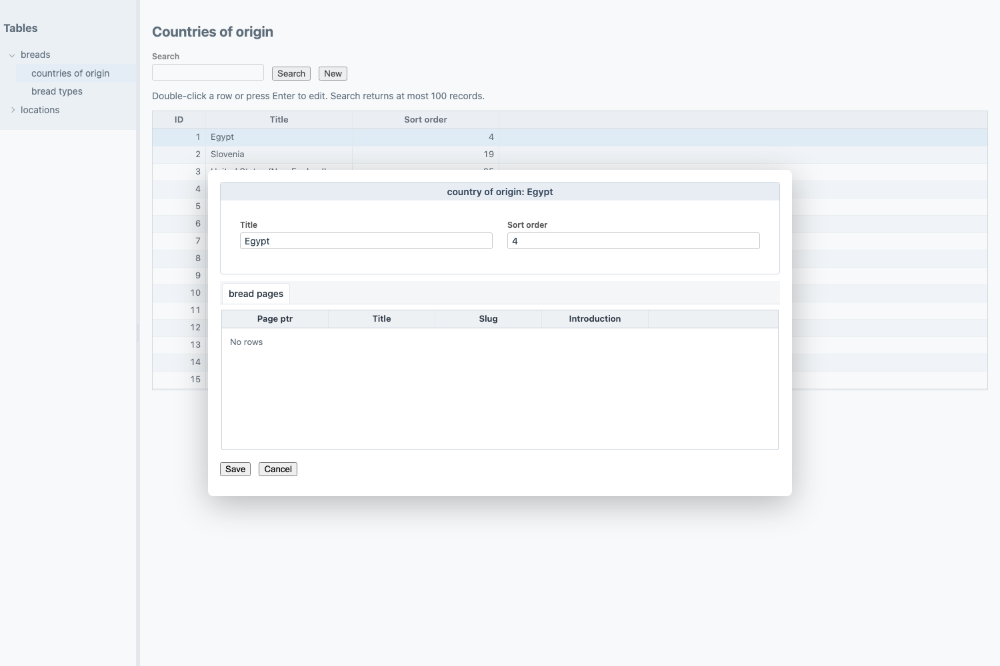
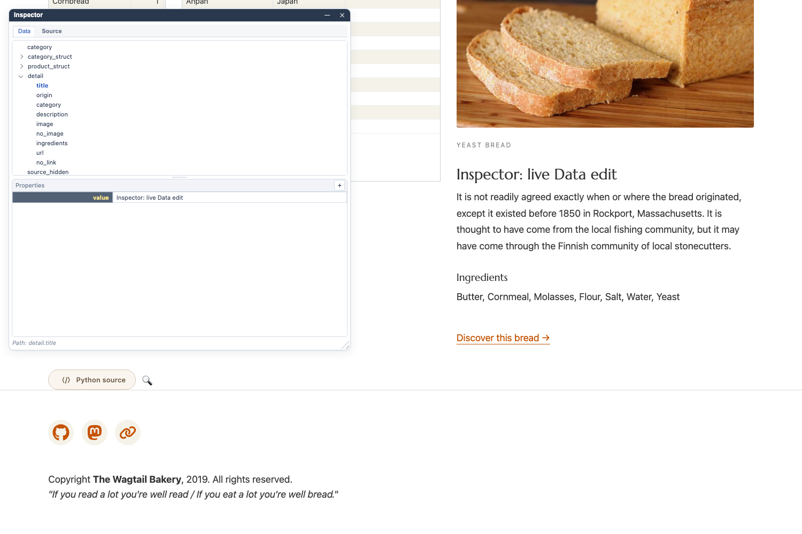

<p></p>

# gramlot-django

**[Browse the Django adapter source →](src/gramlot_django/)**

The implementation formerly under `gramlot.contrib.django` now lives here in
`src/gramlot_django`. Import it as `gramlot_django`.

- [Django hosting, URLs and RPC](src/gramlot_django/application.py)
- [Django pages and ORM selection helpers](src/gramlot_django/page.py)
- [Schema](src/gramlot_django/schema.py), [table pages](src/gramlot_django/tables.py)
  and [IDE integration](src/gramlot_django/ide.py)
- [Runnable examples](examples/) and [behavior tests](tests/)


**Current compatibility lane:** this extracted adapter develops and tests against
sibling `gramlot-poc`, not the documentation-only clean `gramlot` repository.
The clean product's [constitution](https://github.com/gramlot-org/gramlot/blob/main/docs/00-constitution.md)
guides subsequent reviewed integration work. Existing package imports are unchanged.


Django hosting, page authoring and ORM integration for Gramlot.

**Status: proof of concept (POC), under active review and consolidation.**

Treat everything in this repository as experimental. The intention is to turn
this POC into a reviewed prerelease soon; that transition has not happened yet.
These previews are for evaluating APIs and design choices. Documentation describes
the intended behavior, not a guarantee that every path is bug-free. Bugs, incomplete
features and changes in behavior are expected during experimentation.
APIs, architecture and examples can change. The downloadable GitHub preview is
labelled a prerelease for distribution purposes, but it remains a POC and does
not establish a stable product contract. It is not published on PyPI.

Gramlot itself is being reviewed and consolidated:

- **[gramlot-poc](https://github.com/gramlot-org/gramlot-poc)** is the reference
  for the experimental, executable version of Gramlot used by this adapter.
- **[gramlot](https://github.com/gramlot-org/gramlot)** will contain the first
  actual, consolidated product version. It currently holds the product principles
  and reviewed-port process; do not use it as an installable replacement for the POC.

Working code and tests in the POC are evidence for review, not automatic acceptance
into the future product. Start with Gramlot's
[constitution](https://github.com/gramlot-org/gramlot/blob/main/docs/00-constitution.md)
and [overview](https://github.com/gramlot-org/gramlot/blob/main/docs/01-overview.md).

## Server and database adaptation

Gramlot supplies the independent Python declarations, Source/Data model and
JavaScript browser runtime. External integrations have two separate roles:

| Role | Responsibility | Django implementation in this POC |
| --- | --- | --- |
| Server adaptation | Connect pages and services to the host: requests, routes, authentication, CSRF and responses | Django views, URLconf, middleware and request context |
| Database adaptation | Connect data services to the database or ORM: queries, projections and schema | Django ORM helpers, including `selection_result` and schema browsing |

Each supported server supplies its server-specific adaptation; each supported
database integration supplies its database adaptation. Django participates in
both roles. Hosting and database choices remain architecturally independent:
using Django as a host does not make database behavior part of the server contract.
Current Django ORM helpers do not imply implementation of every future shared
database capability. See [architecture](docs/030-architecture.md).

## Documentation for people and LLMs

Following Gramlot's documentation convention, `docs/` contains expanded explanations
and `docs_llm/` contains concise, human-readable counterparts. Paired documents keep
the same decisions, constraints, implementation status and open questions; they are
updated together. Filenames are ordered in steps of five (`005`, `010`, `015`);
paired guides share stable document and section IDs, such as `GD-040-025` for
admin validation. See the [numbering policy](docs/055-documentation.md#gd-055-020).

Start with the [human overview](docs/005-overview.md) or its
[LLM-oriented counterpart](docs_llm/005-overview.md). The
[documentation policy](docs/055-documentation.md) identifies the initial paired set
and the existing detailed guides that have not yet been paired.

## Experimental examples

The examples use the experimental version of Gramlot maintained in
[gramlot-poc](https://github.com/gramlot-org/gramlot-poc). They will be progressively
adapted as Gramlot evolves and its APIs are reviewed and consolidated. Treat their
current code as experimental examples, not as a stable API reference.

## Implemented POC scope

- `DjangoPageCollection`: normal Django URLconf integration, page discovery,
  Source/Data RPC, packaged runtime delivery and host templates.
- `DjangoPage`: request context, page permissions and explicit ORM selections.
- Schema browsing, `DjangoTablesPage` and `DjangoIdePage`.
- Real middleware, CSRF, authentication, ORM and transaction behavior tests.
- Customer example and adapted Bakery/Wagtail demonstration.

Use Django's normal settings, middleware, database configuration and management
commands. Application UI and interactions are authored through Python Gramlot
pages. See [the integration guide](docs/035-django.md) and [examples](examples/README.md).

## Install the GitHub preview

Python 3.11+; no Node.js or local Gramlot checkout is required.
In a virtual environment, install this adapter with one command:

```sh
python -m pip install 'git+https://github.com/gramlot-org/gramlot-django.git@main'
gramlot-django demo --open
```

The current adapter automatically downloads a checksummed experimental core wheel
from this repository's GitHub assets. Its package version is `0.1.5`: this is a
packaged POC snapshot, not a claim that `gramlot` or `gramlot-poc` publishes a
matching source release. You do not need either core checkout or a core Git tag.
The core wheel includes Python APIs and the compiled browser runtime.
The older `v0.1.0-preview.1` adapter tag predates this automatic dependency setup;
use `main` for the command above. `pip install gramlot-django` from PyPI alone is not
available yet. See [GitHub preview details](docs/010-github-preview.md),
[the quickstart](docs/015-quickstart.md) and [release procedure](docs/065-release.md).

## Bonus: genro-bag for other Python projects

Installing `gramlot-django` also installs
[`genro-bag`](https://github.com/genropy/genro-bag), the Python library behind
Gramlot's Data Bags. A Bag is a hierarchical data container with XML serialization.
It can also be useful outside Gramlot—for organizing nested data, configuration
or data exchanged between Python components.

`genro-bag` is independently usable: it does not require a Gramlot interface or
a Django application. You can install it on its own with `pip install genro-bag`.
See the [genro-bag documentation](https://genro-bag.readthedocs.io).

## Bakery showcase

The full Wagtail Bakery site is the main integration demonstration, with Gramlot
SPA pages inside its navigation and templates. See [Bakery setup](docs/025-bakery-demo.md)
for `gramlot-django demo bakery`. Its dependencies and project files remain separate.

## Experimental SPA admin and Inspector

The Bakery preview includes a SPA table admin: explicit model/field declarations
produce grids and forms through Django ModelForms and Gramlot declarations.
Custom form validation participates in remote field checks and saving. Relations
have initial selectors and read-only related grids. This is an experiment in APIs
and design choices; intended behavior may have bugs and is not complete admin coverage.
See [forms, validation and limitations](docs/040-admin-spa.md).



In Explore, the small magnifying glass opens the **Inspector**. Browse live **Data**
and **Source**, then edit values or declaration attributes to see their effects
on the running page. These edits do not rewrite Python files; bindings and services
may react to data changes. The separate Python source viewer is read-only.
See the [step-by-step Inspector guide](docs/045-inspector.md), including screenshots,
reload behavior and the scope of these experimental interactions.



## Polls demo

With the package installed:

```sh
gramlot-django demo --open
```

This starts a Django Polls site with an embedded Gramlot SPA and shared SQLite votes at
`http://127.0.0.1:8064/polls/`. See [demo options](docs/020-polls-demo.md).
This downloadable preview remains a POC, not a production release.

## Documentation build

The Sphinx documentation uses the classic Read the Docs theme with the shared
Gramlot logo, blue header, dark sidebar and light content. CI builds the HTML with warnings treated as errors.
The repository includes Read the Docs configuration; see
[build and hosting instructions](docs/060-readthedocs.md) for the external project setup.

## Development

Python 3.11+; Django 5.2 or 6.0 subject to its Python requirements.
The integration requires the **local Gramlot 0.1.5 source**, not the older
0.1.0a1 package currently published on PyPI. Keep the `gramlot-poc` checkout beside
this repository; `tool.uv.sources` explicitly selects it for development.

```sh
uv sync --extra dev --extra docs
uv run python scripts/check.py
uv run mypy src/  # advisory
uv run python -m build
uv run python -m twine check dist/*
git config core.hooksPath hooks
```

See [getting started](docs/050-getting-started.md) for installation details and
[the ownership specification](SPECIFICATION.md) for the core/adapter boundary.
`develop` is the development branch; `main` is the baseline.
See [candidate verification](docs/085-candidate-verification.md) for the passing local
package and offline browser checks. Manual publication workflows are prepared
but have not been triggered.
No deployment is configured.

## License

Apache License 2.0. Copyright 2026 Softwell S.r.l. See LICENSE and NOTICE.
The Bakery snapshot retains its upstream license in `examples/bakerydemo/LICENSE`.
