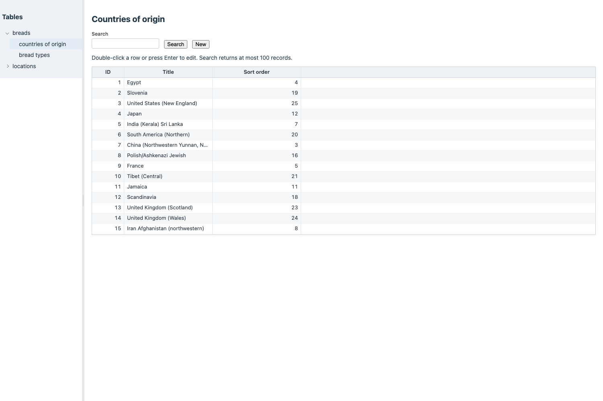
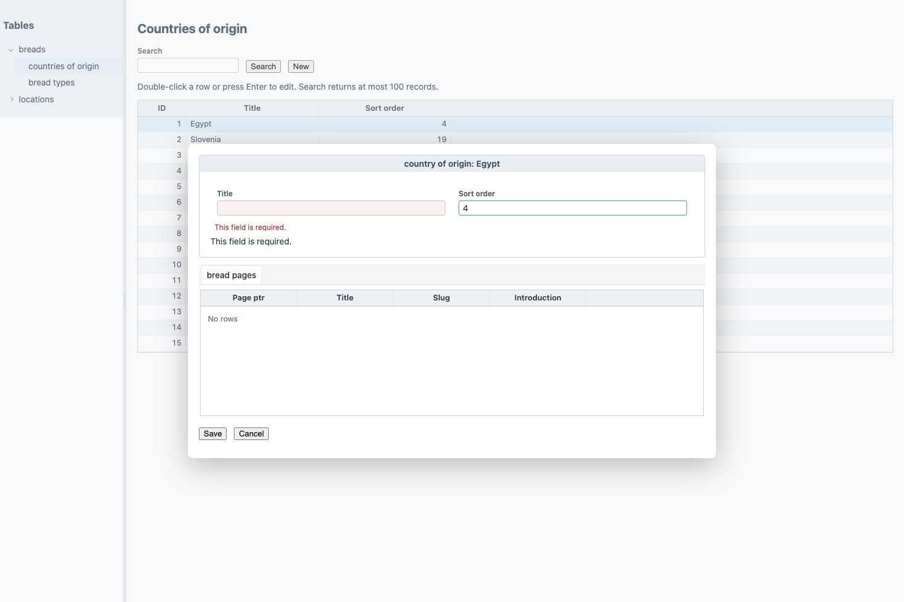

# Experimental SPA admin, forms and validation

[Concise counterpart](https://github.com/gramlot-org/gramlot-django/blob/main/docs_llm/admin-spa.md).

## 1. Preview status

This is a preview for evaluating APIs and design choices. The behavior below is
intended behavior: bugs and incomplete cases may exist. It is not a stable admin
product or a complete replacement for Django admin or Wagtail editing workflows.

## 2. Try the Bakery example

Follow [Bakery setup](bakery-demo.md), then open `/spa_admin/tables/` on its local
server. Sign in with the demo staff account. Expand **breads**, select **countries
of origin**, and double-click a row (or press Enter). **New** opens a draft where
creation is enabled; **Cancel** closes the draft. **Save** requests a database write.
The native Django admin remains separate. These screens require active staff
status and the corresponding Django model permissions.



## 3. Declare the exposed models

The adapter owns `DjangoTablesPage`. Applications explicitly expose model fields:

```python
from gramlot_django.tables import DjangoTablesPage

class TablesPage(DjangoTablesPage):
    table_fields = {'myapp.country': ['title', 'sort_order']}
```

Replace the example model label with a real model in your project, and register
this page in your Django page collection. This declaration supplies the table
navigation and limits the fields available to its services. It does not grant
permissions. Search currently returns at most 100 rows.

## 4. How forms are generated

For each exposed model, the adapter constructs a Django ModelForm restricted to
the declared fields. It then declares a Gramlot `form` and `formlet`, with controls
bound to the record Data. The browser edits a draft; saving calls the server.

| ModelForm field/widget | Current Gramlot control |
| --- | --- |
| Foreign key or one-to-one relation | `dbSelect` |
| Textarea widget | `textBoxArea` |
| Other supported scalar fields | `textBox` |

This is an initial mapping, not full Django widget coverage. Labels come from the
ModelForm. Exposed reverse and many-to-many relations appear in read-only grids.


## 5. Validation and saving

Generated controls use `validate_remote='validate_record_field'`. The server
validates the candidate field together with the current draft through a ModelForm;
this validation call does not save the record. Field and non-field errors are
returned to the page. On Save, the server independently validates again, checks
permissions and writes inside a transaction; existing rows are locked for update.

To use application validation, supply a ModelForm through `table_forms`:

```python
from django import forms

class CountryForm(forms.ModelForm):
    def clean_title(self):
        title = self.cleaned_data['title'].strip()
        if not title:
            raise forms.ValidationError('Enter a country name.')
        return title

class TablesPage(DjangoTablesPage):
    table_fields = {'myapp.country': ['title', 'sort_order']}
    table_forms = {'myapp.country': CountryForm}
```

The adapter supplies the model and allowed fields when constructing this form.
Django field validation, `clean_<field>()`, form `clean()` and model validation
participate in both validation and saving. Keep clean methods free of side effects:
they can run repeatedly while a user edits. Cross-field validation sees the draft,
which may still be incomplete.



The screenshot shows the current presentation, including a repeated error message;
it illustrates the experiment, not a finished interaction design.

## 6. Boundaries and permissions

Relation choices respect the ModelForm queryset and target model view permissions.
Related grids require explicit exposure of target fields, parent/target view
permissions and a saved parent; they are limited to 100 rows. Parent saves preserve
many-to-many relations. There is no delete UI, complete widget mapping, or generic
Wagtail tree/revision/workflow editor. Bakery disables creation for page models
that need native Wagtail tree insertion. The Inspector is disabled by default on
this table page; it is demonstrated separately in Explore.

## 7. Screenshot scope

Screenshots were captured from the local Bakery POC on 2026-09-16, using the supplied
Gramlot 0.1.5 candidate. Opening a country, clearing its required title and cancelling
were exercised without saving changes. These observations cover those interactions;
they do not promise that every model, validation rule or browser works correctly.
