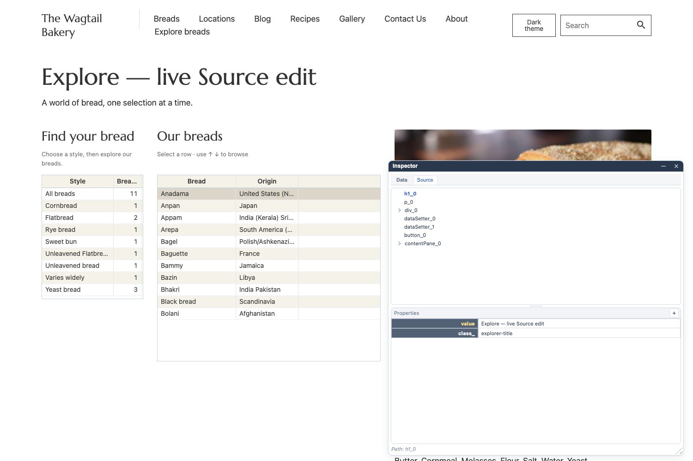

# Experimental Data and Source Inspector

[Concise counterpart](https://github.com/gramlot-org/gramlot-django/blob/main/docs_llm/inspector.md).

## 1. Preview status

The Inspector is an experimental Gramlot tool for understanding and trying the
runtime's APIs and design choices. This guide describes intended behavior; bugs,
incomplete interactions and changes are expected during consolidation.

## 2. Open the Inspector

Start the [Bakery example](bakery-demo.md), open `/products/explore/`, and click the
small magnifying-glass button labelled **Open inspector**. The floating panel has
**Data** and **Source** tabs. Expand a tree node and select a value to see its
properties. The panel can be moved and resized.

## 3. Three different views

| View | What it shows | What editing means |
| --- | --- | --- |
| Inspector Data | The page's live hierarchical Data Bag | Change a runtime value used by bindings |
| Inspector Source | The live declarative UI tree and its attributes | Change the runtime UI declaration |
| Explore's Python source viewer | The Python file that declares the page, in read-only CodeMirror | Read the application code; it is not editable here |

Source in the Inspector is the running declaration tree, not a Python file editor.
The separate IDE is another feature with its own access rules.

## 4. Try a Data edit

1. In Explore, select a bread and open **Data**.
2. Expand `detail` and select `title`.
3. Change **value** in Properties, then click outside that property row to commit.
4. The bound bread title should update in the page.

This example changes a client value. A later selection or data reload can replace
it with the value returned by the service.

## 5. Try a Source edit

1. Select **Source** and choose the heading node (`h1_0` in this example).
2. Change its **value** and leave the property row.
3. The heading should update immediately. Inspect attributes such as `class_` in
   the same panel to see how the declaration describes the element.

Properties include typed scalar editors. The plus button adds an attribute and
the delete control removes one. Complex values are read-only as a single property:
expand their tree and select a scalar child instead. This is not a general-purpose
raw editor for arbitrary objects or Python code.

## 6. Lifetime and effects

Inspector edits affect the running page; they do not rewrite the Python source
files. Reloading rebuilds the page from its declarations and server data. In the
examples above, a reload restores the original heading and bread title.

Changing Data can trigger bindings, controllers and RPCs configured by the page,
so a runtime experiment can have application effects. Database persistence still
uses the application's server services and permission checks. Inspector access
does not bypass those checks. Expose inspection only where appropriate for the
page: `source_inspection` controls availability, and the table admin disables it
by default. The screenshots use Explore, where it is enabled.

## 7. Screenshot scope

These are real local Bakery screenshots captured on 2026-09-16 with the supplied
Gramlot 0.1.5 candidate. The Data title edit, Source heading edit and restoration
after reload were exercised in Chromium. This checks those examples, not every
possible edit or browser, and is not a guarantee of bug-free behavior.
